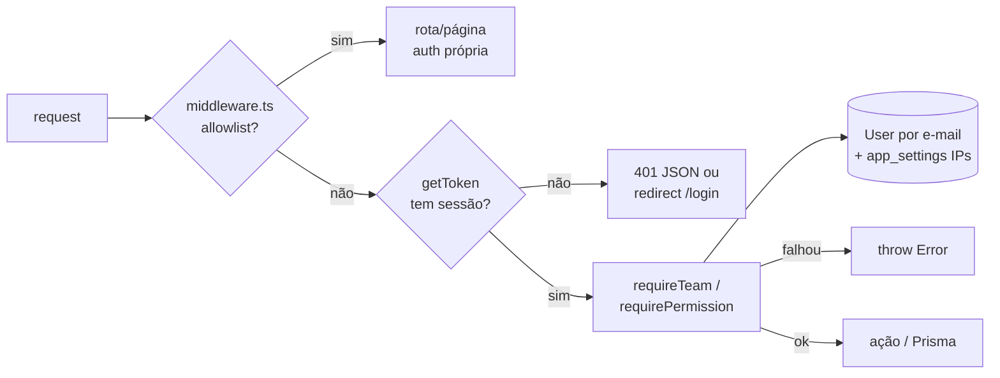

# Autenticação, permissões e segurança — mapa para IA
> Verificado em 2026-09-23 · Escopo: `middleware.ts`, `app/_shared/lib/{auth,permissions,permissions-server,ip-access,password,rate-limit,webhook-auth,managers,sector-admin,chatbot-access,chat-access,ponto-access,ai-review-access,sms,aws-messaging}.ts`, `app/login/**`, `app/_actions/{auth,security,team,users}/**`, `app/api/{auth,admins,user-status}/**`, `app/nova-dash/workspace/security/**`, `app/nova-dash/layout.tsx`, `tests/permissions.test.ts`, `scripts/{bootstrap-permissions,hash-passwords}.mjs`

## TL;DR
- Login por **CPF + senha** (NextAuth v4, Credentials, sessão **JWT** de 30 dias). Equipe e clientes são linhas da **mesma tabela `User`**; o que separa é `User.role` (`ADMIN`/`ADMIN+`/`ADMIN++` = equipe; qualquer outra coisa = card de cliente, `GHOST` = card-fantasma).
- `middleware.ts` só confere se **existe sessão**; não olha cargo. Autorização de verdade é `requireTeam()` / `requirePermission(key)` em `app/_shared/lib/permissions-server.ts`, que leem o cargo **do banco** e aplicam a **trava de IP** do escritório.
- Permissões = padrão do cargo (`ROLE_DEFAULTS`) + overrides em `User.permissions` (Json). `ADMIN++` tem tudo; `manage_team` só vem do cargo.
- Mais quebra: (1) rota nova de cron/webhook que não entra nas allowlists do middleware → 401 antes da rota rodar; (2) ação nova que só checa `getServerSession` — cliente logado passa; (3) esquecer que `session.user.role` do JWT fica congelado até o próximo login.

## Onde fica
| Arquivo | Responsabilidade | Símbolos-chave |
|---|---|---|
| `middleware.ts` | Gate global (Edge): tudo exige sessão, exceto as allowlists | `PUBLIC_PAGE_PREFIXES`, `PUBLIC_API_PREFIXES`, `PUBLIC_GET_APIS`, `PUBLIC_GET_API_PREFIXES`, `PUBLIC_ACTION_PAGES`, `middleware`, `config.matcher` |
| `app/_shared/lib/auth.ts` | Config do NextAuth (Google + Credentials CPF/senha, callbacks jwt/session) | `authOptions` |
| `app/api/auth/[...nextauth]/route.ts` | Handler do NextAuth | `GET`, `POST` |
| `app/api/auth/route.ts` | Login **legado** que emite JWT próprio (`jsonwebtoken`, 7d); nenhum caller encontrado em `app/` | `POST` |
| `app/_shared/lib/permissions.ts` | Catálogo puro (client+server) de cargos e permissões | `TEAM_ROLES`, `isTeamRole`, `PERMISSION_DEFS`, `PERMISSION_CATEGORIES`, `PERMISSION_KEYS`, `PermissionKey`, `roleDefaults`, `parseOverrides`, `resolvePermissions`, `diffFromDefaults` |
| `app/_shared/lib/permissions-server.ts` | Resolve permissões da sessão (cache 30s) e guards | `getSessionPermissions`, `requireTeam`, `requirePermission`, `invalidateSessionPermissionsCache`, `SessionPermissions` |
| `app/_shared/lib/ip-access.ts` | Trava de IP da dashboard (lista em `app_settings`, cache 60s) | `DASHBOARD_ALLOWED_IPS_KEY`, `getClientIp`, `parseIpList`, `getDashboardAllowedIps`, `ipMatches`, `checkDashboardIpAccess`, `invalidateAllowedIpsCache` |
| `app/_shared/lib/password.ts` | bcrypt + compatibilidade com senha legada em texto puro | `hashPassword`, `verifyPassword`, `isHashedPassword` |
| `app/_shared/lib/rate-limit.ts` | Rate limit em memória por instância | `rateLimit` |
| `app/_shared/lib/webhook-auth.ts` | Shared secret de webhook externo (`x-webhook-secret` ou `?secret=`) | `verifyWebhookSecret` |
| `app/_shared/lib/managers.ts` | Allowlist de e-mails da Visão do Gestor (+ env `MANAGER_EMAILS`) | `MANAGER_EMAILS`, `isManager` |
| `app/_shared/lib/ai-review-access.ts` | Allowlist que **só restringe** `review_ai` (+ env `AI_REVIEW_EMAILS`) | `AI_REVIEW_EMAILS`, `isAiReviewer` |
| `app/_shared/lib/chatbot-access.ts` | Allowlist do dashboard do chatbot/custos IA (+ env `CHATBOT_DASHBOARD_EMAILS`) | `canViewChatbotDashboard` |
| `app/_shared/lib/sector-admin.ts` | Quem gere setores (env `SECTOR_ADMIN_IDS` ou fallback de cargo) | `sectorAdminIds`, `isSectorAdmin`, `requireSectorAdmin` |
| `app/_shared/lib/chat-access.ts` | Acesso a canais do chat da equipe | `canAccessChannel`, `canSendToChannel`, `channelRecipients`, `userChannelIds` |
| `app/_shared/lib/ponto-access.ts` | Quem gere ponto (`manage_ponto` + IDs legados) | `canManagePonto` |
| `app/_shared/lib/sms.ts` / `aws-messaging.ts` | SMS Twilio / SMS SNS + e-mail SES (recuperação de senha) | `sendSms`, `isSmsConfigured` / `sendSmsAws`, `sendEmailAws`, `isAwsSmsConfigured`, `isAwsEmailConfigured` |
| `app/login/sections/login-page.tsx` | Form de login (CPF mascarado → só dígitos) | default `AuthSection` |
| `app/login/recuperar-senha/page.tsx` + `sections/AuthShell.tsx` | UI "esqueci minha senha" / shell visual | `RecuperarSenhaPage`, `AuthShell` |
| `app/_actions/auth/password-reset.ts` | Código de 6 dígitos (10 min, 5 tentativas, cooldown 60s) | `getRecoveryChannels`, `requestPasswordReset`, `confirmPasswordReset` |
| `app/_actions/team/permissions.ts` | Permissões do logado e edição de overrides | `getMyPermissions`, `getTeamPermissions`, `setUserPermissions` |
| `app/_actions/team/update-team.ts` / `get-team.ts` | Troca de cargo / lista da equipe | `UpdateRole` / `getAdmins` |
| `app/_actions/security/ip-lock.ts` | Ler/gravar lista de IPs (anti-lockout) | `getIpLockSettings`, `setDashboardAllowedIps` |
| `app/_actions/users/*` | CRUD de usuário/card, perfil próprio, senha do cliente, avatar | `createUser`, `deleteAdmin`, `updateUser`, `updateMyProfile`, `getMyProfile`, `getClientAccessPassword`, `setClientAccessPassword`, `findDuplicateClient`, `getUsers` |
| `app/nova-dash/layout.tsx` | Gate de IP server-side da dashboard (tela "Acesso restrito ao escritório") | `NovaDashLayout` |
| `app/nova-dash/_components/PermissionsProvider.tsx` | Contexto client (só esconde UI; busca `getMyPermissions` 1× no mount) | `PermissionsProvider`, `usePermissions` |
| `app/nova-dash/workspace/security/SecurityPanel.tsx` | Seção "Segurança" do Espaço de Trabalho | `SecurityPanel` |
| `app/nova-dash/_components/team_dash.tsx` | Tela Equipe (cargos, permissões, criar/remover membro) | default `TeamDialog` |
| `app/api/admins/route.ts` | Lista id/nome/cargo da equipe (só exige sessão) | `GET` |
| `app/api/user-status/route.ts` | Status/role/service do próprio logado (GET está em `PUBLIC_GET_APIS`, mas `getUserStatus` exige sessão) | `GET`, `POST` |
| `app/_actions/users/user-status.ts` / `get-status-user.ts` | Status do próprio logado / nome+serviço por id (área do cliente) | `getUserStatus`, `updateUserStatus` / `getStatus` |

## Fluxo principal
**Login (equipe e cliente usam o mesmo form):**
1. `login-page.tsx` → `signIn("credentials", { cpf: <só dígitos>, password })`.
2. `authOptions.providers[Credentials].authorize` (`auth.ts`): `rateLimit` (10/IP e 5/CPF por 15 min) → `db.user.findMany({ cpf, password not null, take 10 })` (**CPF não é único**) → `verifyPassword` em cada candidato → se legado em texto puro, re-grava com `hashPassword` (migração lazy).
3. Callback `jwt` grava `id`, `role`, `service` no token **só no login**; `trigger === "update"` propaga apenas `name`/`email`/`picture`. Callback `session` expõe `session.user.{id,role,service}`.
4. Cliente: `getSession()` e redireciona por `role.startsWith("ADMIN")` → `/nova-dash`, senão `/area-do-cliente`.

**Cada request:**

1. `middleware.ts`: libera allowlists; senão `getToken` (tenta cookie `__Secure-` e o nome alternativo). Sem token: API/server action → 401 JSON; página → redirect `/login?callbackUrl=...`.
2. Página `/nova-dash`: `layout.tsx` chama `getSessionPermissions()` + `checkDashboardIpAccess()` (bloqueio de IP); `page.tsx` (client component, só UI) esconde a dashboard de quem não é `isTeamRole(session.user.role)` e monta `PermissionsProvider` → `getMyPermissions()`.
3. Server action/API da equipe: `requirePermission(key)` → `requireTeam()` → `getSessionPermissions()` (busca `User` **por e-mail da sessão**, `resolvePermissions`, + `isManager` concede `manager_dashboard`, `isAiReviewer` retira `review_ai`) → `checkDashboardIpAccess(bypass_ip_lock)` → lança `Error` se falhar.

**Recuperação de senha (anônima, `/login/recuperar-senha` está em `PUBLIC_ACTION_PAGES`):**
`getRecoveryChannels(cpf)` (destino mascarado; e-mail placeholder com "inserir-email"/"inserir_email" = sem e-mail) → `requestPasswordReset(cpf, "sms"|"email")` (upsert `PasswordResetCode` com hash; SMS tenta SNS → Twilio → WhatsApp `sendText`; e-mail só SES) → `confirmPasswordReset(cpf, code, nova)` (senha ≥ 7, grava bcrypt + `usedAt` em transação).

**Trava de IP:** `SecurityPanel` → `setDashboardAllowedIps` (exige `manage_team`, valida formato, recusa lista que tranque o próprio autor sem bypass) → upsert `app_settings` → `invalidateAllowedIpsCache()` (só na instância atual) → `createLog` com `metadata.stage = "ip_lock"`.

## Dados
- **`User`** (`prisma/schema.prisma`): `role` String com default = nome de coluna do kanban (não é enum). Equipe = `ADMIN`/`ADMIN+`/`ADMIN++`; `GHOST` = card-fantasma interno; demais valores = coluna do card de cliente. `email` é `@unique` e é a **chave de lookup das permissões** (cliente sem e-mail recebe placeholder `<cpf>@inserir-email.com` em `createUser`). `cpf` **não** é único e é gravado só com dígitos por `createUser`/`updateUser` (via `stripFormat`). `password` nullable; pode ser hash bcrypt (`$2a$/$2b$/$2y$`) ou legado em texto puro. `permissions` Json? = overrides parciais `{ chave: boolean }`; `null` (`Prisma.DbNull`) = padrão do cargo.
- **`PasswordResetCode`** (`password_reset_codes`): um por usuário (`userId @unique`, **sem FK/relação** com `User`), `codeHash` bcrypt, `attempts`, `expiresAt`, `usedAt`.
- **`AppSetting`** (`app_settings`): chave `dashboard_allowed_ips` (`DASHBOARD_ALLOWED_IPS_KEY`), valor = IPs separados por quebra de linha/vírgula/ponto e vírgula; entrada terminada em `*` = prefixo (IPv6). Lista vazia = trava desligada; sem linha no banco → env `DASHBOARD_ALLOWED_IPS`.
- **`Account` / `Session` / `VerificationToken`**: tabelas do `PrismaAdapter`; com `session.strategy: "jwt"` a tabela `Session` não guarda sessão.
- **`Log`** (via `createLog`): ações `password_view`, `password_set` (senha do cliente), `update` com `metadata.stage = "ip_lock"`.
- Permissões: **23 chaves** em `PERMISSION_DEFS`, em **6 categorias** de `PERMISSION_CATEGORIES` (nomes exatos, na ordem da tela):
  - "Kanban" (6): `delete_cards`, `manage_automations`, `create_columns`, `edit_columns`, `delete_columns`, `create_hospitals`.
  - "Arquivados e pagamentos" (4): `view_archived`, `view_pagos_caique`, `view_pagos_uni`, `archive_cards`.
  - "WhatsApp e IA" (4): `review_ai`, `manage_wa_contacts`, `manage_wa_numbers`, `run_ai_audit`.
  - "Documentos e contratos" (2): `manage_contracts`, `manage_templates`.
  - "Gestão e equipe" (6): `view_tickets`, `manager_dashboard`, `view_costs`, `view_all_mentions`, `manage_ponto`, `manage_team`.
  - "Segurança" (1): `bypass_ip_lock`.
- Envs: `NEXT_AUTH_SECRET`/`NEXTAUTH_SECRET`, `NEXTAUTH_URL`, `GOOGLE_CLIENT_ID/SECRET`, `MANAGER_EMAILS`, `AI_REVIEW_EMAILS`, `CHATBOT_DASHBOARD_EMAILS`, `SECTOR_ADMIN_IDS`, `DASHBOARD_ALLOWED_IPS`, `CRON_SECRET`, `BOTCONVERSA_WEBHOOK_SECRET`, `CHATBOT_SECRET`, `WHATSAPP_APP_SECRET`, `SES_FROM_EMAIL`, `SNS_SMS_SENDER_ID`, `TWILIO_*`, `WHATSAPP_CRED_KEY`.

## Regras invioláveis e armadilhas
- **Toda ação/rota da equipe precisa de `requireTeam()` ou `requirePermission()`** — o middleware aceita qualquer sessão, inclusive de cliente logado por CPF.
- **Ainda sem guarda de equipe (confirmado no código):** `updateUser` (`app/_actions/users/update-users.ts`) só checa sessão e aceita `role` arbitrário para qualquer `id`; `getUsers` devolve campos sensíveis (`senha_inss`, CPF) a qualquer sessão; `createUser` só exige `manage_team` quando `role` é da equipe; `app/api/admins/route.ts`, `app/api/automations/**` (exceto `cron/`, que usa `CRON_SECRET`) e `app/api/hospitals/route.ts` não checam cargo; `POST /api/user-status` deixa **cliente logado gravar o próprio `User.status`** (= etapa do card); `POST /api/process-status` aceita qualquer sessão; `getStatus` (`get-status-user.ts`) não checa nada. Não copie esses padrões; ao mexer neles, adicione `requireTeam()`.
- **Server action em página de `PUBLIC_ACTION_PAGES` roda sem sessão** — ela mesma tem que se autenticar (ou ser inofensiva).
- **Algumas permissões são só de UI**: `manage_automations` (`KanbanBoard.tsx`) e `create_hospitals` (`HospitalCombobox.tsx`) não têm checagem no servidor. `create_columns`/`edit_columns`/`delete_columns`/`view_tickets` são checadas em `app/api/labels/**` e `app/api/dev-tickets/route.ts` via `getSessionPermissions()` — que **não** aplica a trava de IP (só `requireTeam` aplica).
- **`session.user.role` é do JWT e só muda no próximo login** (30 dias). Rotas que decidem por `session.user.role` (ex.: `app/api/board-state/route.ts`, `app/api/documents/route.ts`, `app/api/logs/route.ts`, `app/_actions/whatsapp/*`) continuam liberando um rebaixado/removido — e **não aplicam a trava de IP**. `getSessionPermissions` lê o banco (cache 30s por instância, chave = e-mail).
- **E-mail é a chave das permissões**: trocar o e-mail de um membro fora do `ProfileDialog` (que chama `update()` da sessão) — ex.: via `updateUser` — deixa a sessão dele sem permissões até relogar.
- **Servidor em até 30s, UI só após recarregar**: `UpdateRole`, `setUserPermissions` e `deleteAdmin` não chamam `invalidateSessionPermissionsCache` (nenhum caller no app) — no servidor o override/cargo novo vale em até 30s (`PERM_CACHE_TTL_MS`, cache de `getSessionPermissions` por instância). Mas a UI da pessoa afetada não acompanha: `PermissionsProvider` chama `getMyPermissions()` UMA vez no mount e `usePermissions()` não refaz o fetch — até ela recarregar a página, vê botão que o servidor recusa ou não vê o que acabou de ganhar.
- **Crons fora da allowlist do middleware levam 401 antes de rodar**: `/api/costs/sync`, `/api/maintenance/retention` e `/api/automations/cron/time-check` estão no `vercel.json`, validam `CRON_SECRET` na rota, mas **não** estão em `PUBLIC_API_PREFIXES` (provável causa do sync de custos parado — não verificado em produção). Cron/webhook novo → adicionar ao `PUBLIC_API_PREFIXES` **e** validar o segredo na rota.
- Página pública nova → `PUBLIC_PAGE_PREFIXES`; se usa server action anônima → também `PUBLIC_ACTION_PAGES` (senão a action leva 401).
- **`manage_team` nunca por override** (`resolvePermissions` zera; `diffFromDefaults`/`setUserPermissions` descartam). `ADMIN++` ignora overrides. **Sempre manter ≥1 `ADMIN++`** (`UpdateRole` e `deleteAdmin` recusam rebaixar/remover o último).
- **Permissão nova** → só `PERMISSION_DEFS` (com `category`) + as 3 entradas de `ROLE_DEFAULTS` (TS exige). `NO_PERMISSIONS` do provider é derivado de `PERMISSION_KEYS`. Sem `requirePermission` no servidor, a permissão é decorativa.
- Allowlists de e-mail (`managers.ts`, `chatbot-access.ts`, `ai-review-access.ts`) são **hardcoded + env** e comparam e-mail normalizado. `isManager` só **concede**; `isAiReviewer` só **restringe** (tira `review_ai` de quem não está na lista, inclusive ADMIN++). No client (`Workspace.tsx`) `isManager` não enxerga a env `MANAGER_EMAILS`.
- `sector-admin.ts`: fallback é `["ADMIN", "ADMIN++"]` — **`ADMIN+` fica de fora** (o comentário diz só ADMIN++). Usa `session.user.role` do JWT.
- **Trava de IP não roda no middleware** (Edge sem banco): mora em `app/nova-dash/layout.tsx` + `requireTeam()`. Lista vazia = desligada; IPs `::1`, `127.0.0.1` e `desconhecido` sempre passam; `getClientIp` usa o 1º `x-forwarded-for` (fallback `x-real-ip`).
- `verifyWebhookSecret` **fica aberto** (só loga aviso) se a env não existir; o webhook da Meta (`WHATSAPP_APP_SECRET`) e `/api/whatsapp/brain-prompt` (`x-bot-secret`) **fecham** sem env.
- Senhas: sempre `hashPassword`; nunca comparar direto — use `verifyPassword`. Hash não pode ser exibido: `getClientAccessPassword` só devolve texto de senha legada e registra log `password_view`. Tamanho mínimo diverge: 7 (login/reset/senha do cliente) × 8 (`updateMyProfile`).
- Login busca `cpf` **igual** aos dígitos enviados; `findAccountByCpf` (reset) e `findDuplicateClient` comparam por `regexp_replace`. CPF gravado com máscara acha no reset mas **não loga**.
- O código de reset usa `Math.random` (o comentário diz "criptograficamente aleatório" — não é).
- **Reset anônimo sem `rateLimit`**: `getRecoveryChannels` revela se o CPF existe + primeiro nome + telefone/e-mail mascarados; `requestPasswordReset` só tem cooldown de 60s por usuário (cada envio custa SMS). `findAccountByCpf` pega `LIMIT 1` sem ordem e só exclui `GHOST` — com CPF duplicado pode trocar a senha de outro cadastro, e vale também para contas da equipe.
- Fallback WhatsApp do reset: `sendText` sem `numberId` sai pelo número das envs legadas e é texto livre — só entrega com janela de 24h aberta.
- `rateLimit` é por instância da Vercel (limite real é maior que o configurado).
- O `callbackUrl` que o middleware põe na URL **não é lido** pelo `login-page.tsx` (redireciona por cargo).
- Segredo do NextAuth: `authOptions.secret` lê `NEXT_AUTH_SECRET` (NextAuth cai em `NEXTAUTH_SECRET` se vazio); middleware aceita os dois; `app/api/auth/route.ts` e `app/_shared/lib/whatsapp/crypto.ts` (fallback de `WHATSAPP_CRED_KEY`) usam `NEXT_AUTH_SECRET`. Trocar esse segredo derruba sessões e pode invalidar tokens da Meta salvos.
- O provider **Google segue registrado** em `authOptions` sem botão na UI. Se `GOOGLE_CLIENT_ID/SECRET` existirem no deploy (não verificado), `/api/auth/signin/google` cria `User` novo via `PrismaAdapter` com `role` default (= coluna do kanban, ou seja, card) — não vira equipe.
- Cookie: HTTPS usa `__Secure-next-auth.session-token`; com `NEXTAUTH_URL` https, `getServerSession` local só enxerga esse nome.
- Erro lançado em server action vira mensagem genérica em produção — o texto de `requireTeam`/`requirePermission` não chega ao usuário.
- Não existe o pacote `server-only` no projeto — não importar.

## Receitas
- **Proteger uma server action nova** → primeira linha `const ctx = await requirePermission("<chave>")` (ou `requireTeam()`) de `app/_shared/lib/permissions-server.ts` · cuidado: não use `getServerSession` sozinho; `requirePermission` chama `requireTeam`, então também aplica a trava de IP (fora do escritório só passa quem tem `bypass_ip_lock`) — `getSessionPermissions` sozinho não aplica · valide chamando logado como cliente (deve lançar).
- **Criar permissão** → `PERMISSION_DEFS` + `ROLE_DEFAULTS` em `app/_shared/lib/permissions.ts`; guard no servidor; esconder UI com `usePermissions().perms.<chave>` · cuidado: padrão do ADMIN/ADMIN+ conservador · valide com `npm test -- tests/permissions.test.ts` e o dialog "Permissões" da tela Equipe.
- **Página pública nova (site/área do cliente)** → `PUBLIC_PAGE_PREFIXES` em `middleware.ts` (+ `PUBLIC_ACTION_PAGES` se usar action) · cuidado: prefixo casa `p` e `p/...` · valide em aba anônima.
- **Cron ou webhook novo** → validar `CRON_SECRET` (padrão `isCronAuthorized` em `app/api/whatsapp/cron/auth.ts`) ou `verifyWebhookSecret(req, "<ENV>")` na rota **e** adicionar o caminho em `PUBLIC_API_PREFIXES` · valide com `curl -H "Authorization: Bearer $CRON_SECRET"` sem cookie (não pode dar "Não autenticado").
- **Mudar cargo/permissões de alguém** → tela Equipe (`team_dash.tsx` → `UpdateRole` / `setUserPermissions`) · cuidado: o JWT da pessoa mantém o cargo antigo até relogar; servidor em até 30s (cache); a UI dela só muda depois de recarregar a página.
- **Liberar Visão do Gestor / revisão da IA / dashboard do chatbot** → override `manager_dashboard` na tela Equipe, ou env `MANAGER_EMAILS` / `AI_REVIEW_EMAILS` / `CHATBOT_DASHBOARD_EMAILS` (redeploy) · cuidado: `review_ai` exige permissão **e** e-mail na lista.
- **Mexer na trava de IP** → UI `SecurityPanel.tsx` / action `setDashboardAllowedIps` / lógica `checkDashboardIpAccess` · cuidado: lockout (a guarda só cobre quem salva); efeito em até 60s nas outras instâncias · valide com usuário sem `bypass_ip_lock` fora da lista.
- **Resetar senha de cliente pela equipe** → `setClientAccessPassword` em `app/_actions/users/client-password.ts` (loga `password_set`).
- **Migrar senhas legadas de uma vez** → `node scripts/hash-passwords.mjs` (dry-run) e depois `--apply`.
- **Novo canal de envio do código de reset** → `requestPasswordReset` em `app/_actions/auth/password-reset.ts` (ordem SNS → Twilio → WhatsApp) · cuidado: nunca revelar destino completo (use `maskPhoneDisplay`/`maskEmailDisplay`).
- **Recuperar acesso de Super Admin** → `scripts/bootstrap-permissions.mjs` (idempotente, promove um ID fixo a ADMIN++ e grava overrides legados) · só em emergência; confira o ID no script antes · cuidado: re-rodar faz merge dos overrides antigos e **desfaz revogações** feitas depois na tela Equipe.

## Testes e validação
- `tests/permissions.test.ts` (vitest, `npm test`): `isTeamRole`, `resolvePermissions` (ADMIN++ total, override concede, `manage_team` nunca por override, não-equipe sem nada), `parseOverrides` (ignora lixo), `diffFromDefaults`. Não há teste de middleware, `requireTeam`, trava de IP, senha ou reset.
- CI: `.github/workflows/ci.yml` (tsc + lint + vitest).
- Manual: (1) aba anônima em `/nova-dash` → redirect `/login`; `curl` numa `/api/...` da equipe sem cookie → 401 JSON; (2) login como cliente → cai em `/area-do-cliente`; server action da equipe deve lançar "Acesso restrito à equipe."; (3) ADMIN sem `bypass_ip_lock` fora da lista → tela "Acesso restrito ao escritório"; (4) `/login/recuperar-senha` com CPF de teste → código chega, 6ª tentativa errada bloqueia; (5) após mudar permissão, esperar 30s e recarregar.

## Fronteiras
- **Kanban/cards**: `createUser`, `updateUser`, `getUsers` (`app/_actions/users/*`) são o CRUD de card de cliente; colunas checam `create_columns`/`edit_columns`/`delete_columns` em `app/api/labels/**`.
- **WhatsApp**: `requestPasswordReset` usa `sendText`/`isWhatsAppConfigured` (`app/_shared/lib/whatsapp/client.ts`) e `normalizePhoneBR` (`.../whatsapp/outbound.ts`); `updateUser` propaga nome a `whatsAppContact` e chama `notifyStatusProgress`; guards próprios por `TEAM_ROLES` em `app/_actions/whatsapp/contacts.ts` e `conversations.ts`; `manage_wa_numbers`/`manage_wa_contacts`.
- **Chat da equipe**: `chat-access.ts` usado em `app/_actions/chat/*` e `app/api/chat/{messages,read,typing}`.
- **Setores**: `requireSectorAdmin` em `app/_actions/sectors/manage-sectors.ts`; `isSectorAdmin` em `list-sectors.ts`.
- **Ponto**: `canManagePonto` em `app/api/ponto-adjustments/route.ts` e `app/api/work-session/route.ts`.
- **IA/analytics/custos**: `canViewChatbotDashboard` em `app/_actions/analytics/get-chatbot-analytics.ts` e `get-ai-corner.ts`; `review_ai`, `run_ai_audit`, `view_costs` via `requirePermission`.
- **Assinatura eletrônica**: rotas públicas `/assinar`, `/verificar`, `/api/signature/pdf` (token do link é a credencial) e `rateLimit` em `app/assinar/[token]/actions.ts`.
- **Logs/auditoria**: `createLog` (`app/_shared/lib/log.ts`).
- **Espaço de Trabalho**: `Workspace.tsx`/`WorkspaceSidebar.tsx` mostram seções por `perms` (`seguranca` = `manage_team`).
